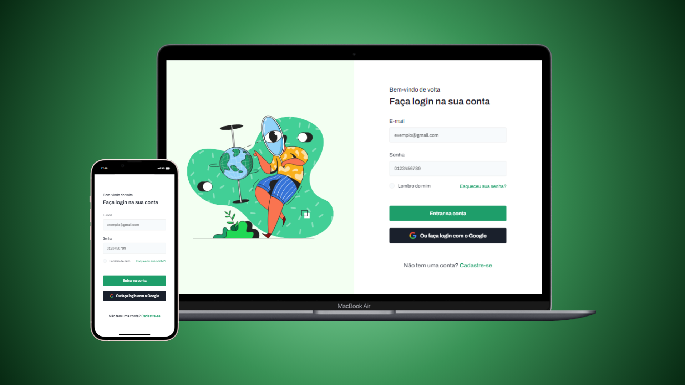

# Desafio Login Form

Hoje trago para vocês mais um desafio proposto pela comunidade Codelândia.

## Índice
- [Desafio Login Form](#desafio-login-form)
  - [Índice](#índice)
  - [Visão Geral](#visão-geral)
    - [Screenshots](#screenshots)
      - [Site](#site)
    - [Link](#link)
  - [Meu Processo](#meu-processo)
    - [Tecnologias/Programas Utilizados](#tecnologiasprogramas-utilizados)
  - [Conclusão](#conclusão)

## Visão Geral 

O desafio se consiste em apenas duas partes, a primeira logo a sua esquerda é possível visualizar uma ilustração, dando um aspecto bonito e agradável aos olhos, já a nossa direita é possível ver o formulário em si, temos os inputs para colocar o e-mail e a senha do usuário, e dois botões, um para logar e o outro para logar com uma conta google, por último temos um link para caso o usuário não esteja cadastrado.

OBS: Os formulário e os botões são apenas ilustrativos.

### Screenshots

#### Site

### Link

- Site do Login Form: [Clique Aqui](https://desafio-login-swart.vercel.app)

## Meu Processo
Esse é meu segundo projeto utilizando React, comparado ao último projeto realizado com essa tech, foi bem mais tranquilo trabalhar e organizar os elementos propostos no desafio, sendo assim, consegui realizar o projeto de forma totalmente tranquila e objetiva.

### Tecnologias/Programas Utilizados

- React
- Figma
- Git

## Conclusão

Mais e mais projetos em React virando e com mais funcionalidades, como realmente clicar nos botões, algo que realmente faça o usuário interagir com o site se sentindo mais imerso no mesmo, logo logo estarei trazendo cada vez mais sites incríveis.